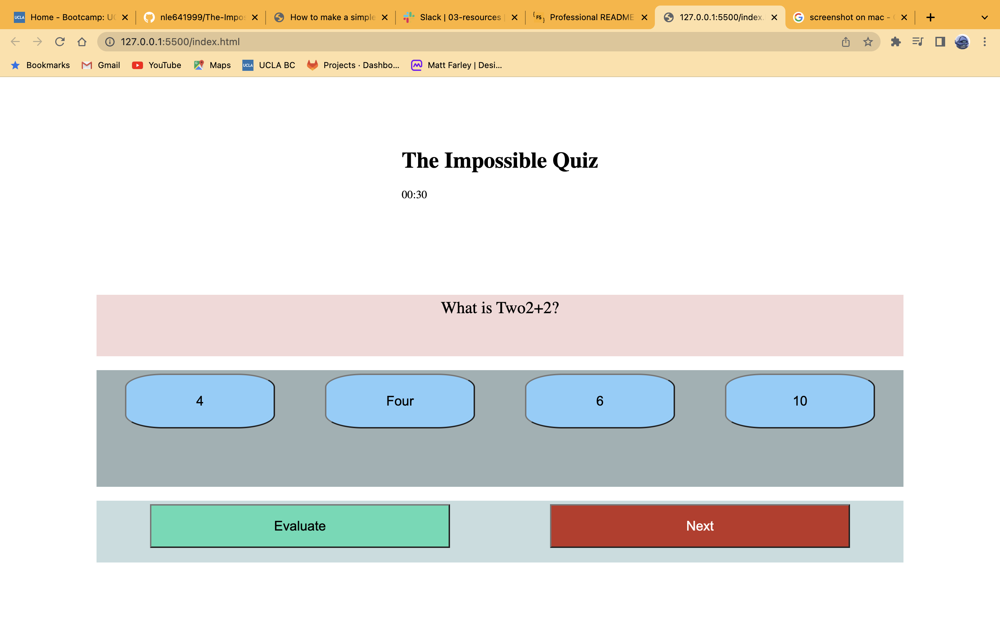

# The-Impossible-Quiz
## Description

A quiz application built using mostly JS. Presents a timer as well as whether a question is correct or incorrect.


## Usage

Provide instructions and examples for use. Include screenshots as needed.

To add a screenshot, create an `assets/images` folder in your repository and upload your screenshot to it. Then, using the relative filepath, add it to your README using the following syntax:

    ```md
    
    ```
